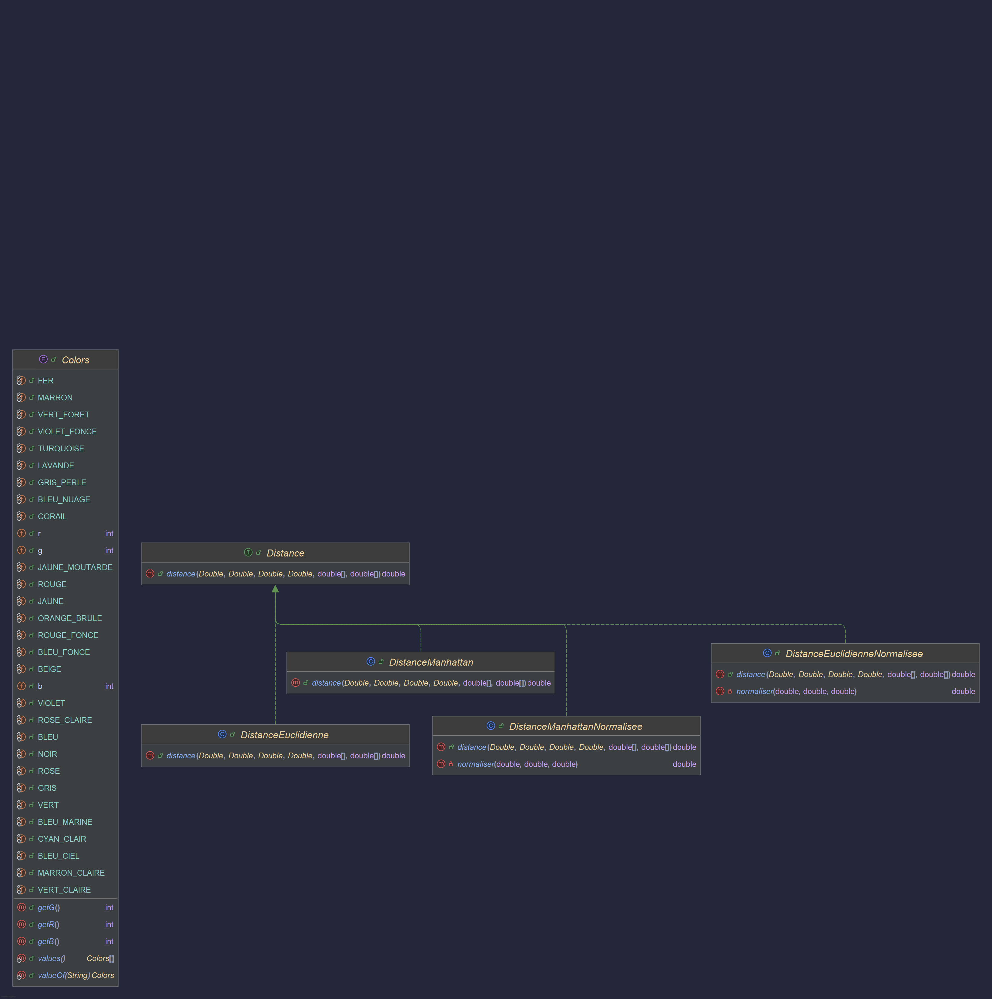

- [1. KFIND - Algorithme de classification par plus proches voisins-](#1-kfind---algorithme-de-classification-par-plus-proches-voisins-)
    - [1.0.1. Fonctionnalités](#101-fonctionnalités)
    - [1.0.2. Répartition du travail Jalon 1](#102-répartition-du-travail-jalon-1)
    - [1.0.3. Répartition du travail Jalon 2](#103-répartition-du-travail-jalon-2)
    - [1.0.4. Attendus Jalon 2](#104-attendus-jalon-2)
      - [1.0.4.1. La possibilité de visualiser un autre nuage de points qu'Iris, et de choisir les axes de projection de ce nuage](#1041-la-possibilité-de-visualiser-un-autre-nuage-de-points-quiris-et-de-choisir-les-axes-de-projection-de-ce-nuage)
      - [1.0.4.2. Les catégories visibles sur le nuage (couleur, forme). La catégorie qu’on souhaite visualiser sera choisie lors du chargement des données, parmi les catégories énumérables.](#1042-les-catégories-visibles-sur-le-nuage-couleur-forme-la-catégorie-quon-souhaite-visualiser-sera-choisie-lors-du-chargement-des-données-parmi-les-catégories-énumérables)
      - [1.0.4.3. La possibilité d’ajouter un point dont la catégorie est inconnue, et de décider cette catégorie en utilisant l’algorithme k-NN. Ce point doit être ajouté au nuage, de façon visible.](#1043-la-possibilité-dajouter-un-point-dont-la-catégorie-est-inconnue-et-de-décider-cette-catégorie-en-utilisant-lalgorithme-k-nn-ce-point-doit-être-ajouté-au-nuage-de-façon-visible)
    - [1.0.5. Implémentation du k-NN](#105-implémentation-du-k-nn)
    - [1.0.6. Comment lancer l'application ?](#106-comment-lancer-lapplication-)
    - [1.0.7. Problèmes rencontrés](#107-problèmes-rencontrés)
    - [1.0.8. UML](#108-uml)

> Groupe I3 (Yanis El Khabbouzi, Vincent Adriaenssens, Yannis Devos, Nathan Marquis)

# 1. KFIND - Algorithme de classification par plus proches voisins-

### 1.0.1. Fonctionnalités
Toutes les fonctionnalités attendues pour le Jalon 1 ont été implémentées.
Cependant, la partie visuelle de l'IHM et notamment les menus ne sont pas entièrement finalisés

### 1.0.2. Répartition du travail Jalon 1
**Yanis.E** : Création des enums et des modèles (`Iris, RawDataIris, CategoryIris`), implémentation des comboBox

**Vincent** : Création des view(`Accueil, ChoixCategories`) et création des prototypes

**Nathan** : Création des enums et des modèles (`Plateforme, Variety`), implémentation de la fonction ajouterPoint dans la vue

**Yannis.D** : Création des view, des tests (`PlateformeTest`), de la Javadoc, et des fonctions maxIris et minIris

### 1.0.3. Répartition du travail Jalon 2

En tout : 8h d'autonomies

**Yanis.E** : 6h - Généricité et javadoc et tests des fonctions concernées

**Vincent** : 6h - CSS et IHM

**Nathan** : 6h - intégration k-NN et javadoc et tests associés

**Yannis.D** : 6h - Généricité et javadoc et tests des fonctions concernées

**Tous** : 2h - Mise en communs

Compte-rendu qualité de dev : 2h

### 1.0.4. Attendus Jalon 2

#### 1.0.4.1. La possibilité de visualiser un autre nuage de points qu'Iris, et de choisir les axes de projection de ce nuage

- Lors de l'affichage du graphe, nous avons un bouton permettant d'ouvrir une nouvelle fenêtre identique où l'on peut modifier les axes de projection.
- Nous avons fait en sorte que quel que soit le csv ajouté, on puisse visualiser un nuage de point correspondant à nos données (quelques modifications du code pourraient être possible).

---

#### 1.0.4.2. Les catégories visibles sur le nuage (couleur, forme). La catégorie qu’on souhaite visualiser sera choisie lors du chargement des données, parmi les catégories énumérables.

- Durant la création du graphe, nous avons ajouté un bouton permettant de choisir son fichier csv.
- En dessous de ce bouton, nous avons ajouté une ComboBox pour que l'utilisateur puisse choisir les catégories qu'il voudra afficher.
- Nous avons fait en sorte que le fichier csv soit lu par l'application et crée une légende adaptée au contenu du csv.
- Lors de la visualisation du graphe, chaque catégorie possédera une couleur permettant de les différencier.
- Quand un nouveau point sera ajouté au graphe, il aura une forme différente par rapport aux autres afin de pouvoir le visualiser plus facilement.

---
#### 1.0.4.3. La possibilité d’ajouter un point dont la catégorie est inconnue, et de décider cette catégorie en utilisant l’algorithme k-NN. Ce point doit être ajouté au nuage, de façon visible.

- Quand la catégorie du point que l'on souhaite ajouter est inconnue, l'algorithme k-NN est utilisé afin de pouvoir placer ce point sur le graphe.
- Sinon, le point est ajouté avec la catégorie désignée par l'utilisateur.
- L'utilisateur peut choisir avec combien de points il souhaite entrainer l'algorithme.

---

### 1.0.5. Implémentation du k-NN

- L'algorithme k-NN a été implémenté principalement dans la classe `MethodeKnn`, elle contient notamment la méthode predictionCategory qui retourne la catégorie du point 
qu'on a donné selon l'algorithme k-NN. Cette méthode appelle une méthode plusProcheVoisins qui calcule la distance de chaque point d'un jeu de données par rapport à un point donné.
Elle renvoie une Map contenant chaque point avec sa distance, triée par distance les plus proches.
- Pour calculer la distance entre deux points, nous avons utilisé quatre classes qui implémentent une enum Distance, avec une méthode distance(). 
Cette méthode calcule différemment selon la distance que l'utilisateur aura choisie (`DistanceEuclydienne`,`DistanceEuclydienneNormalisee`,`DistanceManhattan`,`DistanceManhattanNormalisee`).
Lors des calculs de distances normalisées, la normalisation se fait sur chaque point avant de faire les calculs. 
La normalisation se fait avec la valeur maximum et minimum de l'attribut en question.
- Concernant les données, le stockage des données se fait dans un premier temps dans une Liste. 
Ensuite, la distance entre chaque catégorie et le point est stockée sous forme de `List` de `Map.Entry`, puis triée de la plus petite à la plus grande distance. 
La liste est ensuite parsée afin d'avoir le nombre de k donné.
Ensuite la méthode parcours cette Liste et ajoute cette distance à un total trié par catégorie. Elle prend ensuite la valeur minimum et renvoie la bonne catégorie.

---

### 1.0.6. Comment lancer l'application ?

Exécuter le fichier (`Main`)

### 1.0.7. Problèmes rencontrés

- Nous avons eu (particulièrement Vincent) un gros blocage pour l'intégration d'un FXML, ce qui a résulté en un échec.
  Vincent a dû donc tout refaire de zéro en JavaFX classique.

- Nous nous sommes aussi heurtés à de nombreux problèmes de compilation, notamment de dépendances Maven comme l'utilisation de Jupiter pour les tests.
  Au niveau de la configuration du pom.xml, nous avons également eu quelques petits couacs.

- Prendre du recul sur le code était très difficile, notamment le fait que nous n'avons pas tous le même raisonnement et les mêmes solutions pour la généricité.

### 1.0.8. UML
- UML Views

- UML Enums

- UML Models
