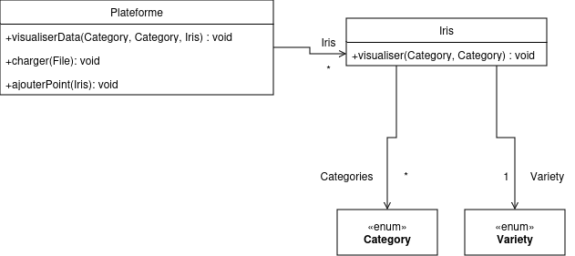

# SAÉ Classification k-NN

### Groupe : i3

**Devos Yannis**,
**El Khabbouzi Yanis**,
**Adriaenssens Vincent**,
**Marquis Nathan**

### Organisation du travail

### Création du projet dans son ensemble

**Yanis.E** : Création des enums et des modèles (`Iris`)

**Vincent** : Création des view(`Menu`)

**Nathan** : Création des enums et des modèles (`Plateforme`)

**Yanis.D** : Création des view (`Graphique`)

---

### Dossier Analyse

**Yanis.E** : Conception du diagramme d'utilisation de la `Classification` et `Realisation des captures d'écrans`.

**Vincent** : Réalisation des deux premières fiches déscriptives : `Charger les données`, `Ajouter un point`, `Diagramme de classe` et `Création du prototype Figma`.

**Nathan** : Remplissage du dossier et réalisation de la dernière fiche descriptive : `Classifier les données non classifiées`.

**Yannis.D** : Remplissage du dossier avec les données fournies par les autres collaborateurs du projet.

## Diagramme de cas d'utilisation

### Fiches descriptives

*Inclure les fiches descriptives pour ces fonctionnalités :*

---

- *Charger l'ensemble de données*

**Système :** Classification

**Cas d'utilisation :**  Charger les données

**Acteur Principal :** Système

**Déclencheur :** /

**Acteurs secondaires :** Utilisatrice

**Préconditions :** Les données doivent être utilisable

**Garanties en cas de succès :** Les données sont chargées et prête à être utilisée

**Garanties minimales :** Message d'erreur

**Scénario nominal :**

1. Le Système propose le choix des données.

2. L'Utilisatrice choisit les données.

3. Le Système charge les données.

**Scénario alternatif :**

A-3.) 1. Le Système ne charge pas les données et envoie un message d'erreur.
    
---

*Ajouter un point*

**Système :** Classification

**Cas d'utilisation :**  Ajouter un point

**Acteur Principal :** Utilisatrice

**Déclencheur :** /

**Acters secondaires :** Système

**Préconditions :** Avoir une donnée à ajouter

**Garanties en cas de succès :** Le point est ajouté

**Garanties minimales :** Message d'erreur

**Scénario nominal :**

1. Le système propose d'ajouter un point.

2. L'utilisatrice choisie d'ajouter un point

3. Le système envoie un formulaire pour le remplir.

4. L'utilisatrice rentre les données de son point et valide.

5. Le système ajoute le point.

**Scénario alternatif :**

A-4) 1. L'utilisatrice ne rentre pas les bonnes données.

2. Le système envoie un message d'erreur et renvoie un formulaire.

---

- *Classifier la donnée non classifiée*

**Cas d'utilisation :** Classifier la donnée non classifiée

**Acteur Principal :** Système

**Déclencheur :** /

**Acteurs secondaires :** /

**Préconditions :** Avoir ajouté une donnée

**Garanties en cas de succès :** La donnée est classifiée

**Garanties minimales :** Rien ne change, message d'erreur

**Scénario nominal :**

1. Le système classifie la donnée en fonction des données déjà existantes.

**Scénario alternatif :**

A-1. Le système affiche un message d'erreur.

-----------------------------------------------------------

### Prototypes pour l'interface

[//]: # (*Inclure des prototypes de l'interface utilisateur pour ces fonctionnalités :*)

[//]: # ()
[//]: # (- *Ajouter une donnée*)

[//]: # (- *Classifier la donnée non classifiée*)

[//]: # (- *Modifier les attributs pour l'affichage*)

[//]: # ()
[//]: # (*Chaque prototype est constitué d'une suite d'écrans, ou d'une arborescence d'écrans si plusieurs chemins d'interaction sont possibles.*)

[//]: # ()
[//]: # (*Pour les deux fonctionnalités dont on demande le prototype et la fiche descriptive, vous ferez le lien entre le prototype et la fiche descriptive. Plus précisément, pour chaque étape de la fiche descriptive, vous indiquerez à quel écran elle correspond. Vous pouvez par exemple mettre une légende sous l'écran, par ex. "Écran pour l'étape 3 de la fiche descriptive du UC Ajouter une donnée."*)

[//]: # ()
[//]: # (*Les prototypes peuvent être en faible fidélité.*)

[//]: # ()
[//]: # (*Les prototypes peuvent être dessinés à la main ou générés en utilisant un logiciel. Dans les deux cas, veillez à ce que les images soient lisibles et avec une bonne résolution &#40;possibilité de zoomer pour lire le texte qui s'y trouve&#41;.*)

## Prototype réalisé sur Figma

[Lien : Prototype](https://www.figma.com/proto/cmpBWdZNVjdDIdwvBl3dUk/Untitled?node-id=0-1&t=G19whqfNrGmfcktp-1)
## Diagramme de classe

*Diagramme de classe décrivant l'application et les fonctionnalités*
